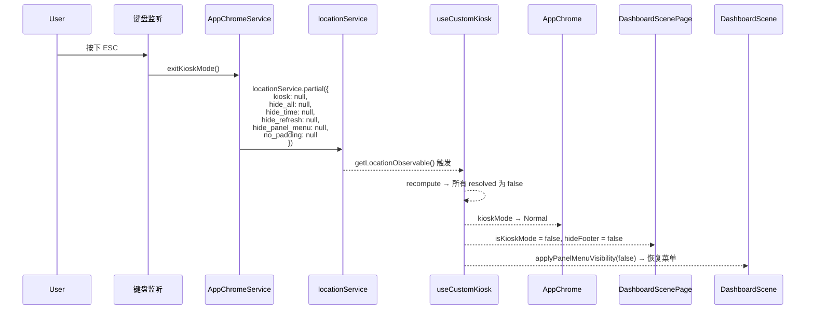
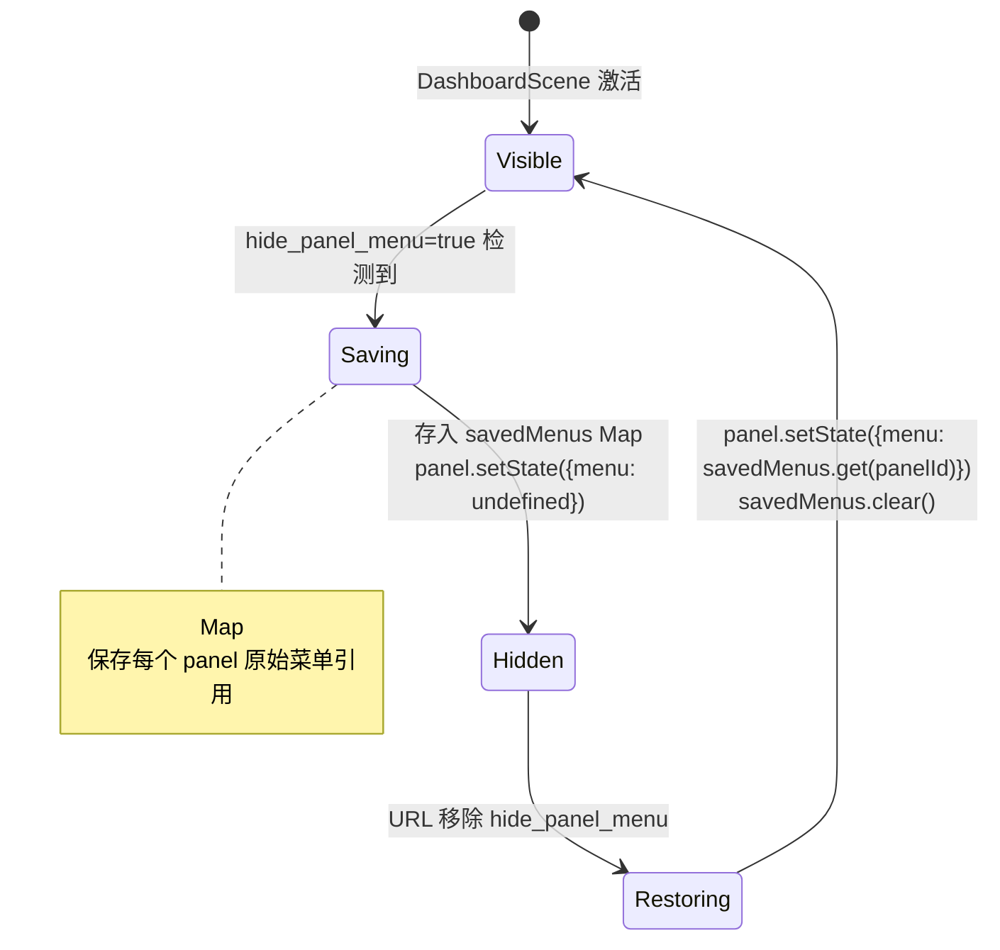
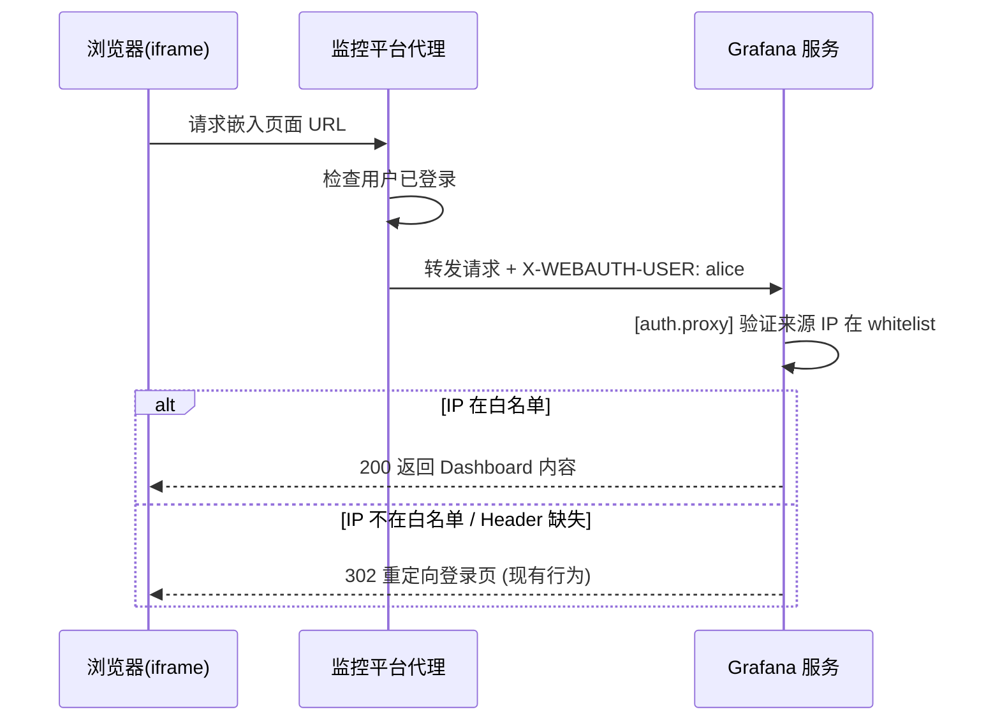

# Grafana 增强型 Kiosk 与 Auth Proxy 嵌入 — 需求变更落地说明

| 项目 | 内容 |
|------|------|
| 文档版本 | 1.0.0 |
| 变更分支 | `feat/frontOps` |
| 基线版本 | Grafana v13（本地构建 `main` @ `f0a0379`) |
| 落地日期 | 2026-04-10 |
| 状态 | ✅ 已完成，待合并 |
| 关联 OpenSpec | `openspec/changes/enhanced-kiosk-auth-proxy-embed/` |

---

## 1. 需求背景与目标

### 1.1 背景

Grafana 原生 Kiosk 模式（`?kiosk=1`）只提供粗粒度的全局界面隐藏能力——一旦启用，整个顶栏和侧栏全部消失，没有办法只隐藏时间控件而保留刷新控件，也没有办法单独隐藏 panel 右上角操作菜单。

监控平台将 Grafana 以 iframe 方式嵌入时，存在三类典型矛盾：

| 矛盾 | 现象 |
|------|------|
| 粗粒度隐藏 | 只想隐藏时间选择器，却不得不连刷新按钮一起隐藏 |
| 菜单无法控制 | panel 右上角操作菜单无法通过 URL 参数控制 |
| 无感认证缺失 | iframe 内会重定向到 Grafana 登录页，破坏嵌入体验 |

### 1.2 目标

1. **增强型 Kiosk URL 参数协议**：通过 `hide_all`、`hide_time`、`hide_refresh`、`hide_panel_menu`、`no_padding` 五个新参数，为 Dashboard 和 Solo Panel 路由提供细粒度 UI 隐藏能力。
2. **统一参数解析层**：引入 `useCustomKiosk` Hook，集中处理参数解析、优先级归一化、响应式更新，供所有消费方共用。
3. **Auth Proxy 接入指引**：明确 iframe 嵌入场景的认证前置条件、失败行为与联调步骤，不新增前端认证逻辑。
4. **向后兼容**：不破坏原有 `kiosk`、`_dash.hideTimePicker`、`from`/`to`/`refresh` 等参数的现有行为。

---

## 2. 需求范围

### 2.1 本次变更包含

| 能力 | 说明 |
|------|------|
| `hide_all=true` | 隐藏所有 chrome + 时间/刷新/变量/Links 控件 + panel 菜单 + footer/logo，等效触发 `KioskMode.Full` |
| `hide_time=true` | **仅**隐藏时间范围选择器，不影响刷新控件 |
| `hide_refresh=true` | **仅**隐藏刷新控件，不影响时间选择器 |
| `hide_panel_menu=true` | 隐藏所有 panel 右上角操作菜单，URL 移除后自动恢复 |
| `no_padding=true` | 计算并输出 `removeOuterPadding` 状态；`hide_all` 路径已由 AppChrome chromeless 处理 |
| ESC 键联动 | 退出 kiosk 时同步清除所有自定义参数，避免 chrome 隐藏残留 |
| `kiosk=''` 修复 | 修复 `AppChromeService.setKioskModeFromUrl` 漏处理空串分支的历史 bug |
| Auth Proxy 接入文档 | `embed-guide.md`：配置清单、失败路径验证、iframe 联调步骤 |
| Dashboard scene 路径 | `DashboardScenePage`、`DashboardControls`、`DashboardScene` |
| 旧版 dashboard 路径 | `DashboardPage` + `DashboardGrid.hidePanelMenus` |
| Solo Panel 路径 | `SoloPanelPage.SoloPanelRenderer` + logo 隐藏透传 |

### 2.2 本次变更不包含

- OAuth2 / OIDC / SSO 登录链路
- 后端 API 新增或修改
- 标题、面包屑等未在 PRD 确认的参数
- 多租户模型重构
- 前端 token 注入或认证绕过逻辑
- `no_padding` standalone CSS 应用（`hide_all` 路径已覆盖，独立场景后续迭代）

---

## 3. 落地方案概述

本次变更为**纯前端改动**，采用"集中解析、分层消费"的架构：

```
URL 参数
   │
   ▼
useCustomKiosk（统一解析层）
   │── raw        原始 URL 值
   │── context    页面上下文（isSoloPanelPage / isViewPanelFullscreen）
   └── resolved   归一化布尔标志集合（hideChrome / hideTime / ...）
          │
          ├─► AppChrome           → KioskMode.Full（hide_all/kiosk）
          ├─► DashboardControls   → hideTimeControls / hideRefreshControls /
          │                         hideVariableControls / hideLinksControls
          ├─► DashboardScene      → VizPanel.setState({menu:undefined})，可逆
          ├─► DashboardScenePage  → isKioskMode / hideFooter
          ├─► SoloPanelPage       → effectiveHideLogo
          └─► DashboardPage(旧)   → DashboardGrid.hidePanelMenus
```

**核心设计决策：**
- `resolved` 是唯一消费层输入，消费方不重复判断 `hide_all` 覆盖逻辑
- DashboardScene（Scenes 对象）不能调用 React Hook，因此通过 `DashboardScenePage` 的桥接 `useEffect` 将 `resolved` 写入 scene state
- panel 菜单隐藏使用 `Map<panelId, VizPanelMenu>` 保存原始引用，支持双向恢复

---

## 4. 详细实现方案

### 4.1 新增文件

#### `public/app/features/dashboard-scene/utils/customKioskTypes.ts`

定义所有常量和类型：

```typescript
export const CUSTOM_KIOSK_PARAMS = {
  hideAll: 'hide_all',
  hideTime: 'hide_time',
  hideRefresh: 'hide_refresh',
  hidePanelMenu: 'hide_panel_menu',
  noPadding: 'no_padding',
} as const;

export const CUSTOM_KIOSK_PARAM_LIST = Object.values(CUSTOM_KIOSK_PARAMS);

export interface CustomKioskResolved {
  hideChrome: boolean;      // hide_all | kiosk
  hideTime: boolean;        // hide_all | hide_time
  hideRefresh: boolean;     // hide_all | hide_refresh
  hidePanelMenu: boolean;   // hide_all | hide_panel_menu
  hideVariables: boolean;   // hide_all
  hideLinks: boolean;       // hide_all
  removeOuterPadding: boolean; // hide_all | no_padding
  maximizePanelArea: boolean;  // isSoloPanelPage | isViewPanelFullscreen
  hideKioskFooter: boolean;    // hide_all | kiosk
}
```

#### `public/app/features/dashboard-scene/utils/useCustomKiosk.ts`

核心 Hook 和纯函数：

```typescript
// computeCustomKioskState 是纯函数，可在非 React 上下文中调用
export function computeCustomKioskState(pathname: string, search: string): CustomKioskState

// useCustomKiosk 是响应式 Hook，通过 locationService.getLocationObservable() 订阅 URL 变化
// 提供初始值避免首帧渲染空窗：useObservable(obs, locationService.getLocation())
export function useCustomKiosk(): CustomKioskState
```

**优先级归一化规则：**

| 输入 | `hideTime` | `hideRefresh` | `hidePanelMenu` | `hideVariables` | `hideChrome` |
|-----|-----------|--------------|----------------|----------------|-------------|
| `hide_all=true` | ✅ | ✅ | ✅ | ✅ | ✅ |
| `hide_time=true` | ✅ | ❌ | ❌ | ❌ | ❌ |
| `hide_refresh=true` | ❌ | ✅ | ❌ | ❌ | ❌ |
| `hide_panel_menu=true` | ❌ | ❌ | ✅ | ❌ | ❌ |
| `kiosk=1` | ❌ | ❌ | ❌ | ❌ | ✅ |

### 4.2 修改文件

#### `AppChromeService.tsx`

- **修复**：`setKioskModeFromUrl` 补充 `case '':` 分支（历史 bug：`?kiosk=` 空串未触发 kiosk）
- **新增**：`exitKioskMode` 退出时同步清除 `CUSTOM_KIOSK_PARAM_LIST` 全部参数

#### `AppChrome.tsx`

- 在 kiosk URL sync `useEffect` 中检测 `resolved.hideChrome`，若为 true 且 `?kiosk` 参数不存在则调用 `chrome.update({ kioskMode: KioskMode.Full })`

#### `DashboardControls.tsx`

- **新增字段**：`hideRefreshControls?: boolean`（原有 `hideTimeControls` 为独立时间选择器控制）
- **新增 URL key**：`_dash.hideRefreshPicker`，独立控制刷新控件
- **向后兼容**：`_dash.hideTimePicker=true` 继续同时设置 `hideTimeControls=true` 和 `hideRefreshControls=true`
- **渲染拆分**：timePicker 和 refreshPicker 各由独立字段控制，互不干扰
- **`hasControls()` 修正**：timePicker 区域仅在 `hideTimeControls && hideRefreshControls` 同时为 `true` 时才视为完全隐藏

#### `DashboardScenePage.tsx`

- **引入 `useCustomKiosk`**
- **桥接 `useEffect`**：将 `resolved.hideTime/hideRefresh/hideVariables/hideLinks` 以 additive OR 方式写入 `DashboardControls.setState()`（不覆盖 `_dash.*` URL 参数设置的值）
- **`isKioskMode` 扩展**：加入 `|| resolved.hideChrome`，使 `hide_all` 路径统一走 kiosk 逻辑
- **`hideFooter` 修复**（盲区六）：`hideFooter = shouldHideDashboardKioskFooter(queryParams.hideLogo) || resolved.hideKioskFooter`

#### `DashboardScene.tsx`

- **`_activationHandler` 扩展**：
  - 用 `Map<panelId, VizPanelMenu | undefined>` 保存原始菜单引用
  - 激活时立即读取当前 URL 的 `hidePanelMenu` 状态，批量设置 panel 菜单
  - 订阅 `locationService.getLocationObservable()`，URL 变化时动态 apply/restore
  - deactivate 时 unsubscribe，避免内存泄漏

#### `SoloPanelPage.tsx`

- 引入 `useCustomKiosk`，计算 `effectiveHideLogo`：
  ```typescript
  const effectiveHideLogo = hideLogo ?? (resolved.hideKioskFooter ? true : undefined);
  ```
- `SoloPanelPageLogo` 使用 `effectiveHideLogo`，`hide_all=true` 时自动隐藏水印 logo

#### `DashboardPage.tsx`（旧版路径）

- 引入 `computeCustomKioskState`，在 `render()` 中计算并透传 `hidePanelMenus` 给 `DashboardGrid`

---

## 5. 流程图

### 5.1 参数解析与消费流程

```mermaid
flowchart TD
    URL["URL 参数<br/>hide_all / hide_time / hide_refresh<br/>hide_panel_menu / no_padding / kiosk"]
    HOOK["useCustomKiosk()<br/>computeCustomKioskState(pathname, search)"]
    
    URL -->|locationService.getLocation()| HOOK
    
    HOOK --> RAW["raw<br/>(原始值)"]
    HOOK --> CTX["context<br/>isSoloPanelPage<br/>isViewPanelFullscreen"]
    HOOK --> RES["resolved<br/>(归一化布尔集合)"]
    
    RES -->|hideChrome| APPCHROME["AppChrome.tsx<br/>→ KioskMode.Full"]
    RES -->|hideTime<br/>hideRefresh<br/>hideVariables<br/>hideLinks| BRIDGE["DashboardScenePage<br/>桥接 useEffect<br/>→ DashboardControls.setState()"]
    RES -->|hidePanelMenu| SCENE["DashboardScene<br/>_activationHandler<br/>→ VizPanel.setState({menu})"]
    RES -->|hideChrome<br/>hideKioskFooter| PAGE["DashboardScenePage<br/>isKioskMode / hideFooter"]
    RES -->|hideKioskFooter| SOLO["SoloPanelPage<br/>effectiveHideLogo"]
    RES -->|hidePanelMenu| LEGACY["DashboardPage(旧版)<br/>DashboardGrid.hidePanelMenus"]
    
    BRIDGE --> DC["DashboardControls<br/>hideTimeControls<br/>hideRefreshControls<br/>hideVariableControls<br/>hideLinksControls"]
    DC -->|条件渲染| UI_TIME["TimePicker 显/隐"]
    DC -->|条件渲染| UI_REFRESH["RefreshPicker 显/隐"]
    DC -->|条件渲染| UI_VAR["Variables 区 显/隐"]
    DC -->|条件渲染| UI_LINKS["Links 区 显/隐"]
```

### 5.2 ESC 键退出 kiosk 联动流程



### 5.3 panel 菜单可逆隐藏机制



### 5.4 Auth Proxy 嵌入认证流程



---

## 6. 变更影响范围

### 6.1 前端文件变更清单

| 文件 | 类型 | 变更说明 |
|------|------|---------|
| `dashboard-scene/utils/customKioskTypes.ts` | 新增 | 5 个常量 + 4 个 TypeScript 接口 |
| `dashboard-scene/utils/useCustomKiosk.ts` | 新增 | 核心 Hook + 纯函数，无副作用 |
| `dashboard-scene/utils/useCustomKiosk.test.ts` | 新增 | 34 个单元测试 |
| `AppChrome/AppChromeService.tsx` | 修改 | 修复空串 bug + 清除自定义参数 |
| `AppChrome/AppChromeService.test.tsx` | 修改 | 新增 6 个测试 |
| `AppChrome/AppChrome.tsx` | 修改 | hide_all → KioskMode.Full |
| `dashboard-scene/scene/DashboardControls.tsx` | 修改 | 拆分 hideRefreshControls + 渲染独立化 |
| `dashboard-scene/scene/DashboardControls.test.tsx` | 修改 | 适配 hideRefreshControls 的 17 个测试 |
| `dashboard-scene/scene/DashboardScene.tsx` | 修改 | 可逆 panel 菜单隐藏 + location 订阅 |
| `dashboard-scene/pages/DashboardScenePage.tsx` | 修改 | 桥接 useEffect + footer/isKioskMode 修复 |
| `dashboard-scene/solo/SoloPanelPage.tsx` | 修改 | effectiveHideLogo 透传 |
| `dashboard/containers/DashboardPage.tsx` | 修改 | hidePanelMenus 传给 DashboardGrid |
| `.nxignore` | 修改 | 排除 `.worktrees*` 防 NX 重复扫描 |
| `openspec/…/embed-guide.md` | 新增 | Auth Proxy 接入指南 |

### 6.2 受影响路由

| 路由 | 影响说明 |
|------|---------|
| `/d/:uid/:slug` (scene 路径) | 全量支持所有新参数 |
| `/d/:uid/:slug` (旧版路径) | 支持 `hide_panel_menu`（通过 `DashboardGrid`）|
| `/d-solo/:uid/:slug` | 支持 `hide_panel_menu`（通过 scene 激活）+ `hide_all` 隐藏 logo |
| `/d/:uid/:slug?viewPanel=X` | 支持 `hide_panel_menu`（scene 激活覆盖全屏 panel）|

### 6.3 不受影响区域

- Grafana 后端 API、数据查询、权限模型
- `from`/`to`/`refresh`/`var-*` 等数据参数语义
- `kiosk=tv`（原生 TV 模式）行为
- `_dash.hideVariables`、`_dash.hideLinks` 原有 URL 参数行为
- `_dash.hideTimePicker` 向后兼容（继续同时隐藏 time + refresh）

---

## 7. 风险与控制措施

| 风险 | 等级 | 控制措施 |
|------|------|---------|
| Auth Proxy `whitelist` 未配置，任意来源可伪造身份 Header | 🔴 高 | 强制前置条件，未配置白名单拒绝上线；前端不做任何认证逻辑 |
| `allow_embedding=true` + 公网暴露导致点击劫持 | 🔴 高 | 仅内网启用；配合 CSP `frame-ancestors` 限制来源域 |
| `cookie_samesite=none` 要求 HTTPS，HTTP 环境 cookie 丢失 | 🟡 中 | 强制 HTTPS 部署；开发环境可用 `disabled` 调试 |
| Grafana 版本升级后 DashboardControls / VizPanel 结构变化 | 🟡 中 | 使用条件渲染而非 CSS hack；避免依赖 DOM 结构 |
| ESC 退出后自定义参数残留（仅含 kiosk 的路径） | 🟢 低 | `exitKioskMode` 已清除 `CUSTOM_KIOSK_PARAM_LIST` 全部参数 |
| panel 菜单 `setState({menu:undefined})` 不可逆 | 🟢 低 | `Map<panelId, menu>` 保存原始引用；URL 移除时恢复 |
| `hide_all` 触发 kiosk 后 footer 显示（盲区六） | ✅ 已修复 | `hideFooter \|\| resolved.hideKioskFooter` |
| `useObservable` 首帧返回 undefined | ✅ 已修复 | 提供初始值 `locationService.getLocation()` |
| `kiosk=''` 空串未触发 kiosk 模式 | ✅ 已修复 | `AppChromeService.setKioskModeFromUrl` 补充 `case ''` |
| `_dash.hideTimePicker` 向后兼容破坏 | ✅ 已验证 | `updateFromUrl` 保持双字段同时设置逻辑 |

---

## 8. 验收结果

### 8.1 自动化测试

| 测试文件 | 测试数 | 结果 |
|---------|------|------|
| `useCustomKiosk.test.ts` | 34 | ✅ 全通过 |
| `AppChromeService.test.tsx` | 6 | ✅ 全通过 |
| `AppChrome.test.tsx` | — | ✅ 全通过 |
| `DashboardControls.test.tsx` | 17 | ✅ 全通过 |
| `DashboardScene.test.tsx` | 100 | ✅ 全通过 |
| `DashboardScenePage.test.tsx` | 20 | ✅ 全通过 |
| `SoloPanelPage.test.tsx` | — | ✅ 全通过 |
| `DashboardPage.test.tsx` | 11 | ✅ 全通过 |
| **合计** | **198** | **✅ 全部通过** |

TypeScript 编译：**0 error** ✅  
ESLint 检查：**0 error / 0 warning** ✅  
`yarn start` 启动：**✅ 正常**（修复了 NX worktree 扫描问题）

### 8.2 spec 一致性验收

| 验收项 | 结果 |
|--------|------|
| `hide_all` 最高优先级，覆盖所有单项参数 | ✅ |
| `hide_all` 触发 `KioskMode.Full` | ✅ |
| `hide_all` 隐藏变量区和 Links 区 | ✅ |
| `hide_time` / `hide_refresh` 各自独立 | ✅ |
| `hide_panel_menu` 可逆（URL 移除后恢复） | ✅ |
| `kiosk=''` 空串视为启用 | ✅ |
| ESC 退出 kiosk 清除所有自定义参数 | ✅ |
| `_dash.hideTimePicker` 向后兼容 | ✅ |
| footer 在 `hide_all` 时正确隐藏 | ✅ |
| solo panel 默认显示菜单，`hide_panel_menu` 后隐藏 | ✅ |
| Hook 响应 URL 变化（history 前进/后退） | ✅ |
| Auth Proxy 失败沿用现有登录/权限处理路径 | ✅（代码核查）|

### 8.3 待人工联调验收项

以下场景需在测试环境配置 Auth Proxy 后进行联调：

| # | 场景 | 预期 |
|---|------|------|
| T1 | `?hide_all=true&from=now-1h&to=now&refresh=5m` | 无 chrome，数据正常刷新，ESC 后 UI 恢复 |
| T2 | `?hide_time=true` 独立隐藏时间选择器 | 刷新控件仍显示 |
| T3 | `?hide_refresh=true` 独立隐藏刷新控件 | 时间选择器仍显示 |
| T4 | `?hide_panel_menu=true` 后移除参数（不刷新页面） | panel 菜单自动恢复 |
| T5 | `/d-solo/:uid?panelId=2&hide_all=true` | 无 logo，panel 内容全屏 |
| T6 | Auth Proxy 已登录用户打开 iframe | 直接显示内容，无登录跳转 |
| T7 | Auth Proxy 失败（白名单外来源） | 现有登录页或权限错误页 |

---

## 9. 发布计划

### 9.1 发布前置条件

- [ ] 测试环境 Auth Proxy 联调完成（T1–T7）
- [ ] Grafana `conf/custom.ini` 配置已就绪：
  ```ini
  [security]
  allow_embedding = true
  cookie_samesite = none
  cookie_secure = true

  [auth.proxy]
  enabled = true
  header_name = X-WEBAUTH-USER
  whitelist = <受信代理 IP>
  ```
- [ ] `feat/frontOps` 分支 PR 审核通过

### 9.2 发布步骤

```bash
# 1. 合并到目标分支（main 或 release 分支）
git checkout main
git merge feat/frontOps

# 2. 构建前端
yarn build

# 3. 重启 Grafana 服务
# （Auth Proxy 配置变更需重启服务端）
```

### 9.3 分阶段建议

| 阶段 | 内容 | 验证标准 |
|------|------|---------|
| Phase 1 | 部署前端变更，使用现有 `kiosk=1` 路径验证基线不回归 | 198 个自动化测试全通过 |
| Phase 2 | 开启 `allow_embedding + cookie_samesite=none`，验证 iframe 基础嵌入 | T1–T5 通过 |
| Phase 3 | 启用 Auth Proxy，验证无感认证 | T6–T7 通过 |

---

## 10. 回滚方案

### 10.1 前端快速回滚（不中断服务）

**嵌入链接层面**（无需部署）：停止在 iframe src 中传递自定义参数即可立即回退到原生 kiosk 行为：

```
# 回退前（使用新参数）
/d/uid/slug?hide_all=true&from=now-1h&to=now

# 回退后（使用原生 kiosk）
/d/uid/slug?kiosk=1&from=now-1h&to=now
```

**代码层面**（需部署）：revert 以下 7 个 commit：

```bash
git revert feat/frontOps  # 或逐个 revert

# 关键 commit SHA（按时间顺序）：
# 3fba4a1  fix(nx): .nxignore 修复（可保留）
# a11e746  fix(kiosk): ESLint 修复
# d50bd4c  feat(kiosk): hide_panel_menu
# 034d0fd  feat(kiosk): DashboardControls + DashboardScenePage
# fa96744  feat(kiosk): AppChrome hide_all
# 4e4590c  feat(kiosk): useCustomKiosk hook
# 71f8e92  feat(kiosk): types + setKioskModeFromUrl 修复
```

### 10.2 Auth Proxy 回滚（需重启服务）

```ini
# conf/custom.ini
[auth.proxy]
enabled = false

[security]
allow_embedding = false
cookie_samesite = lax
```

重启 Grafana 服务后立即生效，iframe 内将重定向到登录页（原有行为）。

### 10.3 回滚影响

| 回滚类型 | 影响 | 恢复时间 |
|---------|------|---------|
| 嵌入链接层（不传自定义参数） | 嵌入体验降级为原生 kiosk | 即时 |
| 前端代码 revert + 重新部署 | 完全恢复，无数据丢失 | 构建 + 部署时间 |
| Auth Proxy 配置关闭 | iframe 内出现登录页 | 重启后即时 |

---

## 附录

### A. URL 参数速查

| 参数 | 类型 | 效果 | 可与 kiosk 共用 |
|------|------|------|----------------|
| `hide_all=true` | boolean | 隐藏全部 chrome + 所有控件 + panel 菜单 + footer | ✅ |
| `hide_time=true` | boolean | 仅隐藏时间选择器 | ✅ |
| `hide_refresh=true` | boolean | 仅隐藏刷新控件 | ✅ |
| `hide_panel_menu=true` | boolean | 隐藏所有 panel 菜单（可逆）| ✅ |
| `no_padding=true` | boolean | 输出 `removeOuterPadding=true`（`hide_all` 路径已覆盖）| ✅ |
| `kiosk=1` / `kiosk` / `kiosk=` | - | 原生 kiosk（全局 chrome 隐藏，不含 panel 菜单）| — |

### B. 相关文档

- OpenSpec 设计文档：`openspec/changes/enhanced-kiosk-auth-proxy-embed/design.md`
- OpenSpec 变更提案：`openspec/changes/enhanced-kiosk-auth-proxy-embed/proposal.md`
- Auth Proxy 接入指南：`openspec/changes/enhanced-kiosk-auth-proxy-embed/specs/auth-proxy-embedded-access/embed-guide.md`
- 原始 PRD：`openspec/doc/prd.md`
- 任务清单：`openspec/changes/enhanced-kiosk-auth-proxy-embed/tasks.md`
